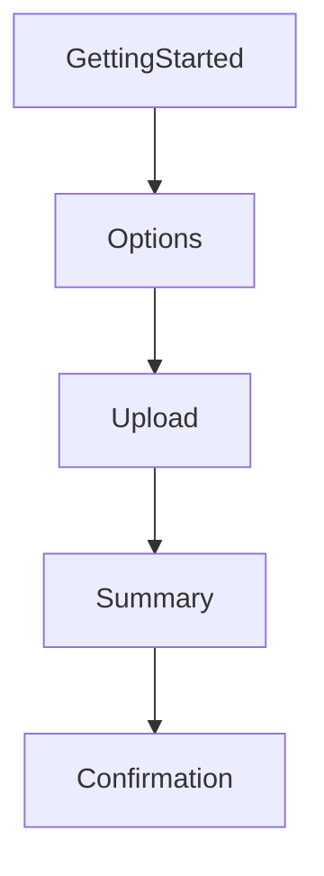

## Printzy — Project Report

### Overview
Printzy is a single-activity Android app built with Kotlin and Jetpack Compose to simulate a print-on-demand ordering flow. Users choose a job type (Book/Document), configure print options, upload files (mock), review the order, and confirm.

### User Flow
- **Start** → select job type
- **Options** → configure print settings (dynamic for Book)
- **Upload** → mock file upload UI
- **Summary** → review options + enter shipping
- **Confirmation** → success message and return to start

### Screens and Responsibilities
- **GettingStarted** (`GettingStartedScreen.kt`): Choose job type; navigates to `options` and sets job type in shared state.
- **Options** (`OptionsScreen.kt`): Dynamic options based on job type.
  - Book: Cover, Book Size, Print Option, Color, Orientation
  - Document: Print Option, Color, Orientation
- **Upload** (`UploadScreen.kt`): Shows a read-only summary of selections; displays one or two upload boxes depending on job type; navigates to `summary`.
- **Summary** (`SummaryScreen.kt`): Order summary and shipping address form; navigates to `confirmation`.
- **Confirmation** (`ConfirmationScreen.kt`): Final success screen with button to pop back to `start`.

### Architecture
- **Pattern**: MVVM-lite with a single shared `OrderViewModel`.
- **Activity**: `MainActivity` sets content, applies `PrintzyTheme`, and hosts a `NavHost` for composable destinations.
- **State**: `OrderViewModel` exposes `order: mutableStateOf(PrintOrder)` and mutation helpers.
- **Navigation**: Compose Navigation, route strings: `start`, `options`, `upload`, `summary`, `confirmation`.

### Data & State Flow
- `MainActivity` creates `OrderViewModel` and passes it to all screens via `PrintzyApp`.
- `GettingStarted` calls `setJobType(...)` before navigating to `options`.
- `Options` collects local UI selection state, then persists via `viewModel.setOptions(...)` and navigates to `upload`.
- `Upload` and `Summary` read from `viewModel.order.value` to render summaries.

### UI & Theming
- **Toolkit**: Jetpack Compose (Material 3)
- **Design**: Simple, centered layouts; outlined cards and buttons; primary blue `#007BFF`; light neutrals.
- **Reusability**: `OptionGroup`, `SelectableButton`, `FileUploadBox`, and simple summary rows.

### Dependencies & Versions (key)
- **Kotlin**: 2.0.0
- **Android Gradle Plugin**: 8.7.3
- **Compile SDK**: 35; **Target SDK**: 34; **Min SDK**: 26
- **Java/Kotlin target**: Java 11, JVM target 11
- **Compose BOM**: 2024.04.01
- **Material 3**: androidx.compose.material3:material3
- **Navigation Compose**: 2.9.0
- **ViewModel Compose**: lifecycle-viewmodel-compose (2.9.1)
- **Activity Compose**: 1.10.1
- **Core KTX**: 1.16.0
- **Material Icons Extended**: 1.7.8

### Build & Run
1. Open in Android Studio (latest stable).
2. Let Gradle sync; ensure an emulator or device is available.
3. Run the app; initial destination is `start`.

### Screenshots
- `screenshots/screen_01_start.png`
- `screenshots/screen_02_options.png`
- `screenshots/screen_03_upload.png`
- `screenshots/screen_04_summary.png`
- `screenshots/screen_05_confirmation.png`

### Known Limitations
- File selection is mocked; no real file I/O.
- No input validation or persistence beyond in-memory `ViewModel` state.
- Pricing and page counts are hard-coded examples.

### Future Enhancements
- Real file picking via Storage Access Framework and upload handling.
- Backend integration for order submission and status (e.g., Retrofit/REST).
- Authentication and order history.
- Payment integration and proper pricing engine.
- Form validation and error handling across screens.
