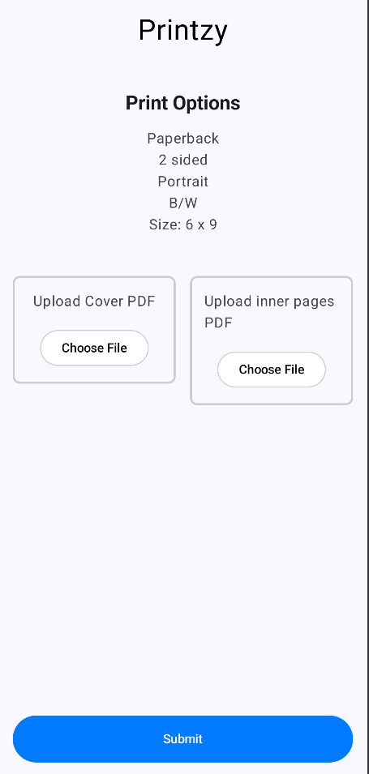
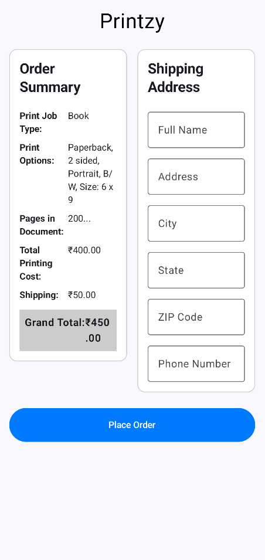
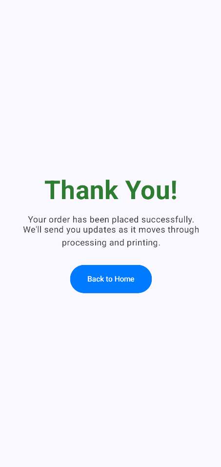

-----

# Printzy - Android Print-on-Demand App

Printzy is a native Android application built entirely with modern Android development tools, including Kotlin and Jetpack Compose. It provides a simple, intuitive user interface for ordering custom print jobs for books and documents. The app guides the user through a seamless multi-step process, from selecting the job type and print options to uploading files and confirming the order.

This project was developed as a practical exercise to demonstrate proficiency in core Jetpack Compose concepts, including UI design, state management, navigation, and building a modular, reusable component architecture.

## 📸 Screenshots

Here is a showcase of the app's user flow:

| Step 1: Getting Started | Step 2: Book Options |
| :---: | :---: |
|  |  |

| Step 3: File Upload | Step 4: Order Summary |
| :---: | :---: |
|  |  |

| Step 5: Confirmation |
| :---: |
|  |

## ✨ Features

  * **Multi-Step Ordering Process:** A guided 5-step workflow for a smooth user experience.
  * **Dynamic UI:** The interface intelligently updates based on user selections (e.g., showing "Book Cover" options only when "Book" is the selected job type). [cite: 2, 3]
  * **State Management:** Utilizes `ViewModel` to persist user selections and order data across all screens, ensuring data integrity throughout the navigation flow.
  * **Reusable Components:** Built with a focus on creating modular and reusable UI components, such as custom buttons and input fields, to maintain a consistent design and clean codebase.
  * **Modern UI with Jetpack Compose:** The entire UI is built declaratively with Jetpack Compose, without using traditional XML layouts.
  * **Navigation Architecture:** Uses the Jetpack Compose Navigation component to manage transitions and the back stack between different screens.

## 🛠️ Tech Stack

  * **Language:** [Kotlin](https://kotlinlang.org/)
  * **UI Toolkit:** [Jetpack Compose](https://developer.android.com/jetpack/compose)
  * **Architecture:** MVVM (Model-View-ViewModel)
  * **Core Components:**
      * **ViewModel:** For state management that is lifecycle-aware.
      * **Compose Navigation:** For handling navigation between composables.
      * **Material Design 3:** For UI components and styling.

## 🚀 How to Run

1.  **Clone the repository:**
    ```bash
    git clone https://github.com/your-username/printzy.git
    ```
2.  **Open in Android Studio:**
      * Open Android Studio (latest stable version recommended).
      * Select `File` \> `Open` and navigate to the cloned project directory.
3.  **Build the project:**
      * Let Android Studio sync the Gradle files.
      * Click the "Run" button (▶️) and select an available emulator or a connected physical device.

## 📂 Project Structure

The project is organized with a focus on clarity and scalability:

```
printzy/
├── app/
│   ├── src/
│   │   ├── main/
│   │   │   ├── java/com/example/printzy/
│   │   │   │   ├── MainActivity.kt      # Main entry point and NavHost setup
│   │   │   │   ├── OrderViewModel.kt    # The shared ViewModel and data class
│   │   │   │   ├── GettingStartedScreen.kt
│   │   │   │   ├── OptionsScreen.kt
│   │   │   │   ├── UploadScreen.kt
│   │   │   │   ├── SummaryScreen.kt
│   │   │   │   └── ConfirmationScreen.kt
│   │   │   └── res/                   # App resources (icons, themes)
│   └── build.gradle.kts             # Module-level build script
└── build.gradle.kts                 # Project-level build script
```

## 🔮 Future Scope

This project serves as a strong foundation for a full-featured application. Future enhancements could include:

  * **Backend Integration:** Connect the app to a real backend service (e.g., using Retrofit) to submit orders and fetch order statuses.
  * **User Authentication:** Add a login/signup flow to manage user profiles and order history.
  * **File Uploads:** Implement actual file-picking and uploading functionality using Android's Storage Access Framework.
  * **Payment Gateway:** Integrate a payment gateway to handle transactions for orders.
  * **Real-time Order Tracking:** Use push notifications to update users on the status of their print job.
